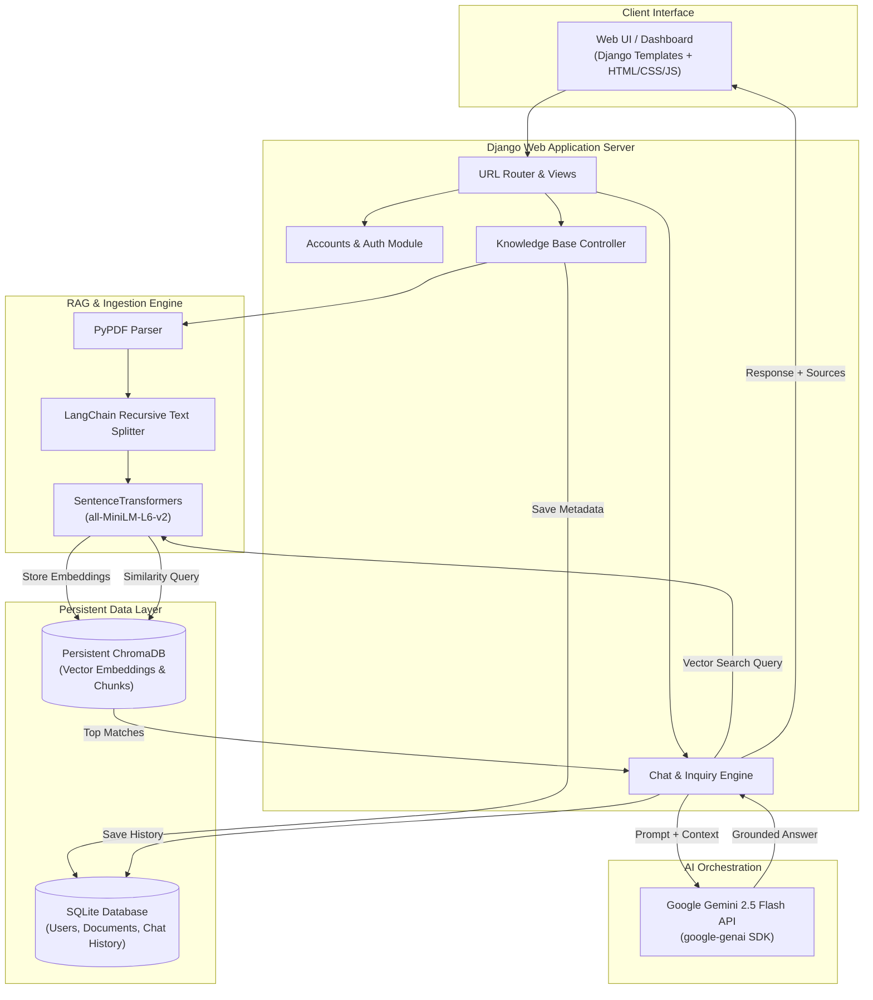

# KnowledgeMind AI · RAG Engineering Showcase


**KnowledgeMind AI** is an end-to-end, production-ready Retrieval-Augmented Generation (RAG) agent showcase built with **Django**, **ChromaDB**, **SentenceTransformers**, and **Google Gemini 2.5 Flash**. It allows users to upload PDF documents, extract knowledge chunks, store embeddings in a vector database, and perform context-aware AI conversations with citation tracking and query history analytics.

---

## 🏛️ System Architecture Diagram



### High-Level Flow Breakdown

```
[ User Uploads PDF ] ──► [ PyPDF Text Extraction ] ──► [ LangChain Chunking ]
                                                              │
                                                              ▼
[ User Receives Answer ] ◄── [ Gemini 2.5 Flash ] ◄── [ Vector Search ] ◄── [ SentenceTransformers ]
```

1. **Document Ingestion**: PDF files uploaded by users are processed using `PyPDF` and split into semantic chunks via `langchain-text-splitters`.
2. **Vector Indexing**: Chunks are processed by `SentenceTransformers` (`all-MiniLM-L6-v2`) to produce 384-dimensional vector embeddings stored in a local persistent `ChromaDB` instance.
3. **Retrieval-Augmented Generation**: User queries are embedded, matched against `ChromaDB` using cosine similarity, and passed alongside context to **Google Gemini 2.5 Flash** for strict context-constrained responses.
4. **Relational Management**: User authentication, uploaded document metadata, and conversation logs are managed using **SQLite (`db.sqlite3`)**.

---

## ✨ Key Features

- 📄 **PDF Document Upload & Ingestion**: Auto-parsing, text extraction, and chunking.
- 🎯 **Semantic Vector Search**: Powered by ChromaDB persistent vector store.
- 🤖 **Context-Aware AI Chatbot**: Grounded Gemini 2.5 Flash responses with exact source snippet references.
- 📊 **Analytics & History Dashboard**: Track past queries, document counts, and engagement metrics.
- 🛡️ **Environment & Credentials Protection**: Strict `.gitignore` locking for API keys and database credentials.
- ☁️ **Render-Ready Deployment**: Configured with `gunicorn`, `whitenoise`, `build.sh`, and `render.yaml`.

---

## 🔒 Security & Environment Locking (.env)

> [!IMPORTANT]
> To prevent leaking API credentials (such as `GEMINI_API_KEY`) and personal data to public GitHub repositories:
> - The `.env` and `.env.txt` files are strictly locked in `.gitignore`.
> - Local databases (`db.sqlite3`) and vector stores (`chroma_db/`) are excluded from Git commits.
> - A safe `.env.example` template is provided in the repository.

---

## 🚀 Local Setup Guide

### 1. Clone the Repository
```bash
git clone https://github.com/Pranavj16/KnowledgeMindAI.git
cd KnowledgeMindAI
```

### 2. Create and Activate Virtual Environment
```bash
# Windows
python -m venv venv
venv\Scripts\activate

# macOS / Linux
python3 -m venv venv
source venv/bin/activate
```

### 3. Install Dependencies
```bash
pip install -r requirements.txt
```

### 4. Set Up Environment Variables
Copy `.env.example` to `.env` and add your **Google Gemini API Key**:
```bash
cp .env.example .env
```
Inside `.env`:
```env
GEMINI_API_KEY=your_actual_gemini_api_key
SECRET_KEY=your_django_secret_key_for_local_dev
DEBUG=True
ALLOWED_HOSTS=*
```

### 5. Run Database Migrations
```bash
python manage.py migrate
```

### 6. Start Development Server
```bash
python manage.py runserver
```
Visit `http://127.0.0.1:8000` in your web browser.

---

## ☁️ Deployment on Render (with SQLite)

This project is configured for seamless zero-downtime deployment on **Render** using a single-file `render.yaml` Blueprint or manual web service creation.

### Option A: Deploy via Render Blueprint (Recommended)

1. Push your repository to **GitHub** (ensuring `.env` is locked and not uploaded).
2. Log into your [Render Dashboard](https://dashboard.render.com/).
3. Click **New +** ──► **Blueprint**.
4. Connect your GitHub repository.
5. Set the required Environment Variable `GEMINI_API_KEY` under the service settings.
6. Click **Apply**. Render will automatically execute `./build.sh` and launch the web server via `gunicorn`.

---

### Option B: Manual Web Service Creation on Render

1. On Render Dashboard, click **New +** ──► **Web Service**.
2. Connect your GitHub repository.
3. Configure the following settings:
   - **Name**: `knowledgemind-ai`
   - **Environment**: `Python`
   - **Build Command**: `./build.sh`
   - **Start Command**: `gunicorn rag_agent.wsgi:application`
4. Add **Environment Variables**:
   | Key | Value | Notes |
   | :--- | :--- | :--- |
   | `GEMINI_API_KEY` | `AIzaSy...` | Your Google Gemini API Key |
   | `SECRET_KEY` | *(Click Generate)* | Secure production key |
   | `DEBUG` | `False` | Disables debug mode in production |
   | `ALLOWED_HOSTS` | `*` or `your-app.onrender.com` | Allowed web hosts |

5. Click **Create Web Service**.

> [!TIP]
> **SQLite Data Persistence Note**: SQLite stores records in `db.sqlite3`. On Render's free tier, local file storage is ephemeral (resets on restart/redeploy). For production persistence, attach a **Render Persistent Disk** and set `SQLITE_DB_PATH=/var/data/db.sqlite3` in your Render Environment Variables.

---

## ⚡ Deployment on Vercel (Zero RAM Limit Serverless)

The project is fully pre-configured for **Vercel Serverless Functions** with WSGI routing (`api/index.py` & `vercel.json`).

### Quick Deploy to Vercel:

1. Push your code to [GitHub](https://github.com/Pranavj16/KnowledgeMindAI).
2. Go to your [Vercel Dashboard](https://vercel.com/dashboard) and click **Add New...** ──► **Project**.
3. Import the `KnowledgeMindAI` repository.
4. Add Environment Variable under Project Settings:
   - `GEMINI_API_KEY`: *(Your Google Gemini API key)*
5. Click **Deploy**. Vercel will build and host your Django application on its global edge serverless network instantly!

---


## 📤 Pushing to GitHub Checklist

Ensure your repository is ready for public or private GitHub pushing:

- [x] `.env` locked in `.gitignore` (Verified!)
- [x] `.env.example` created for reference
- [x] `db.sqlite3` and `chroma_db/` excluded from git tracking
- [x] `requirements.txt` includes `gunicorn` and `whitenoise`
- [x] `build.sh` script made executable
- [x] `render.yaml` Blueprint included

```bash
git add .
git commit -m "feat: setup Render deployment with SQLite and secure environment configuration"
git branch -M main
git remote add origin https://github.com/Pranavj16/KnowledgeMindAI.git
git push -u origin main
```

---

## 🛠️ Tech Stack & Libraries

- **Framework**: Django 6.0.7
- **LLM Engine**: Google Gemini 2.5 Flash (`google-genai` SDK)
- **Vector Database**: ChromaDB
- **Embedding Model**: SentenceTransformers (`all-MiniLM-L6-v2`)
- **Document Processing**: PyPDF & LangChain Text Splitters
- **WSGI & Static Server**: Gunicorn & WhiteNoise
- **Database**: SQLite3

---

## 📜 License

Distributed under the MIT License. See `LICENSE` for more information.
